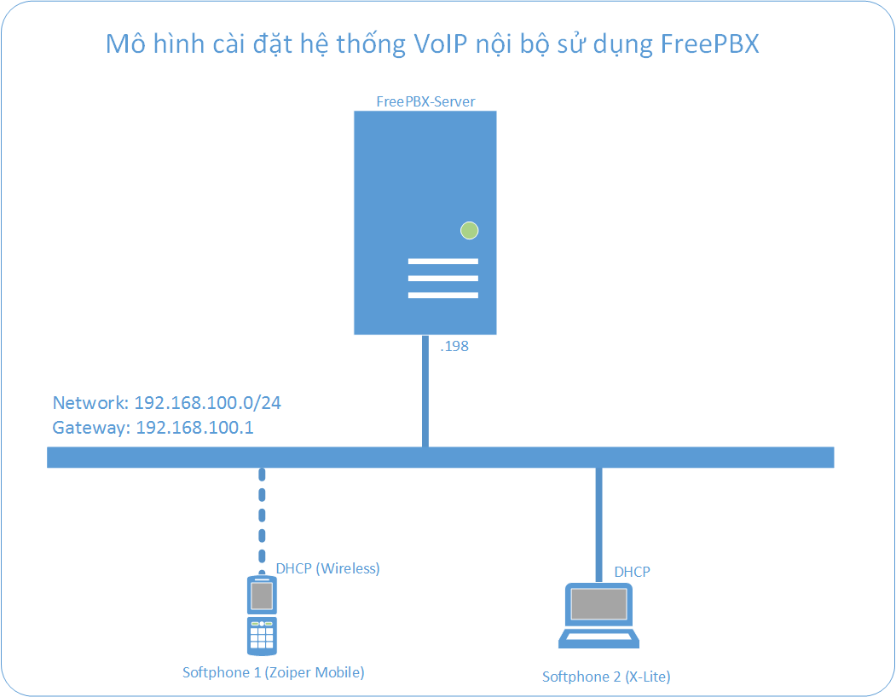
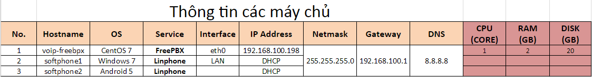
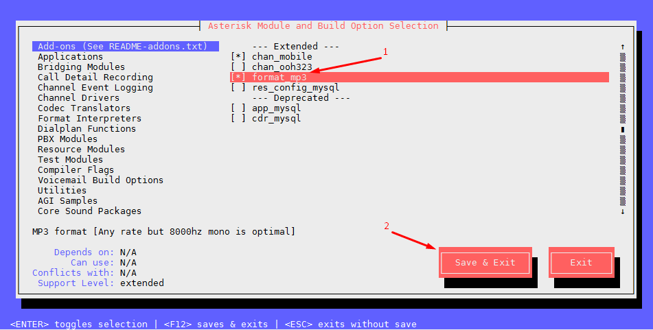

## Hướng dẫn cài đặt tổng đài FreePBX

### Menu

- 1. Chuẩn bị cài đặt
- 2. Các bước tiến hành
- 2.1 Thiết lập hệ thống
- 2.2 Cài đặt các gói hỗ trợ và FreePBX
- 3. Tham khảo

## 1. Chuẩn bị cài đặt

### Mô hình cài đặt



### Bảng phân hoạch IP




Link docs: https://goo.gl/qApSCc

## 2. Các bước tiến hành

### 2.1 Thiết lập hệ thống

**Chú ý**: Các câu lệnh phải chạy với quyền cao nhất là `root`.

- **Bước 1:** Tắt SELinux

	Chỉnh sửa file cấu hình SELINUX tại: */etc/sysconfig/selinux*

	```
	sed -i 's/\(^SELINUX=\).*/\SELINUX=disabled/' /etc/sysconfig/selinux
	sed -i 's/\(^SELINUX=\).*/\SELINUX=disabled/' /etc/selinux/config
	```

	Tắt tức thời bằng lệnh:

	```
	setenforce 0
	```

	Kiểm tra lại bằng lệnh
	
	```
	sestatus
	```

	```
	SELinux status:                 enabled
	SELinuxfs mount:                /sys/fs/selinux
	SELinux root directory:         /etc/selinux
	Loaded policy name:             targeted
	Current mode:                   permissive
	Mode from config file:          disable
	Policy MLS status:              enabled
	Policy deny_unknown status:     allowed
	Max kernel policy version:      28
	```

- **Bước 2:** Cập nhật hệ thống

	```
	yum -y update
	yum -y groupinstall core base "Development Tools"
	```

- **Bước 3:** Cài đặt một số gói đi kèm

	```
	yum -y install lynx mariadb-server mariadb php php-mysql php-mbstring tftp-server \
	httpd ncurses-devel sendmail sendmail-cf sox newt-devel libxml2-devel libtiff-devel \
	audiofile-devel gtk2-devel subversion kernel-devel git php-process crontabs cronie \
	cronie-anacron wget vim php-xml uuid-devel sqlite-devel net-tools gnutls-devel php-pear unixODBC \
	mysql-connector-odbc texinfo gstreamer-python-devel.x86_64
	```

	```
	rpm -Uvh http://repo.iotti.biz/CentOS/7/x86_64/libresample-0.1.3-20.el7.lux.1.x86_64.rpm http://repo.iotti.biz/CentOS/7/x86_64/libresample-devel-0.1.3-20.el7.lux.1.x86_64.rpm
	```
	
- **Bước 4:** Cài đặt Lagacy Pear (PHP)

	```
	pear install Console_Getopt
	```
	
- **Bước 5:** Cấu hình firewalld cơ bản
	Nếu sử dụng firewalld, bạn phải mở port 80 để có thể truy cập vào trang quản trị FreePBX.
	
	```	
	firewall-cmd --zone=public --add-port=80/tcp --permanent
	firewall-cmd --reload
	```
	
- **Bước 6:** Khởi động MariaDB

	```		
	systemctl enable mariadb.service
	systemctl start mariadb
	```
	
	Cài đặt MariaDB cơ bản bằng lệnh:
	
	```		
	mysql_secure_installation
	```
	
	Vui lòng không đặt password cho user `root` của MariaDB.
	
- **Bước 7:** Khởi động HTTPD - APACHE

	```		
	systemctl enable httpd.service
	systemctl start httpd.service
	```
	
### 2.2 Cài đặt các gói hỗ trợ và FreePBX

- **Bước 1:** Cài đặt gói bộ trợ cho Google Voice (Tùy chọn)
	
	- Cài đặt iksemel
	
	```
	cd /usr/src
	git clone https://github.com/meduketto/iksemel
	cd iksemel
	./autogen.sh
	./configure
	make
	make install
	```

- **Bước 2:** Thêm user cho Asterisk

	```	
	adduser asterisk -m -c "Asterisk User"
	```

- **Bước 3:** Cài đặt và cấu hình Asterisk

	- Tải mã nguồn của Asterisk

	```		
	cd /usr/src
	wget http://downloads.asterisk.org/pub/telephony/dahdi-linux-complete/dahdi-linux-complete-current.tar.gz
	wget http://downloads.asterisk.org/pub/telephony/libpri/libpri-current.tar.gz
	wget http://downloads.asterisk.org/pub/telephony/asterisk/asterisk-13-current.tar.gz
	wget -O jansson.tar.gz https://github.com/akheron/jansson/archive/v2.7.tar.gz
	wget http://www.pjsip.org/release/2.4/pjproject-2.4.tar.bz2
	```

	- Biên dịch và cài đặt DAHDI
	
	**Chú ý:** Nếu bạ không có phần cứng PSTN (T1; E1 card) đang gắn vào máy thì không cần thực hiện bước này.
	
	```		
	cd /usr/src
	tar xvfz dahdi-linux-complete-current.tar.gz
	tar xvfz libpri-current.tar.gz
	rm -f dahdi-linux-complete-current.tar.gz libpri-current.tar.gz
	cd dahdi-linux-complete-*
	make all
	make install
	make config
	cd /usr/src/libpri-*
	make
	make install
	```
	
- **Bước 4:** Biên dịch và cấu hình pjproject

	```		
	cd /usr/src
	tar -xjvf pjproject-2.4.tar.bz2
	rm -f pjproject-2.4.tar.bz2
	cd pjproject-2.4
	CFLAGS='-DPJ_HAS_IPV6=1' ./configure --prefix=/usr --enable-shared --disable-sound\
	  --disable-resample --disable-video --disable-opencore-amr --libdir=/usr/lib64
	make dep
	make
	make install
	```

- **Bước 5:** Biên dịch và cấu hình jansson 
	
	```
	cd /usr/src
	tar vxfz jansson.tar.gz
	rm -f jansson.tar.gz
	cd jansson-*
	autoreconf -i
	./configure --libdir=/usr/lib64
	make
	make install
	```

- **Bước 6:** Biên dịch và cấu hình Asterisk

	- **Chú ý:** Một vài trường hợp trong quá trình cài đặt sẽ thiếu file *ari.conf* https://issues.asterisk.org/jira/browse/ASTERISK-27026 Bạn tạo lại file này bằng câu lệnh `mkdir -p /etc/asterisk && touch /etc/asterisk/ari.conf` sau khi biên dịch xong Asterisk.
	
	```		
	cd /usr/src
	tar xvfz asterisk-13-current.tar.gz
	rm -f asterisk-13-current.tar.gz
	cd asterisk-*
	contrib/scripts/install_prereq install
	./configure --libdir=/usr/lib64
	contrib/scripts/get_mp3_source.sh
	make menuselect
	```
	
	- Trong một số trường hợp, bạn muốn sử dụng file MP3 làm nhạc chờ hoặc trong khi Hold cuộc gọi. Hãy chọn `format_mp3` và lưu lại:
	
	
	
	- Tiếp tục biên dịch:
	
	```
	make
	make install
	make config
	ldconfig
	chkconfig asterisk off		
	```
	
- **Bước 7:** Cài đặt các file âm thanh của Asterisk

	- Sở dĩ, trong bước biên dịch bên trên; các file âm thanh đã được bung ra sẵn nhưng ở chất lượng thấp. Chúng ta tải thêm file chất lượng cao và giải nén chúng vào thư viện của Asterisk.
	
	```
	cd /var/lib/asterisk/sounds
	wget http://downloads.asterisk.org/pub/telephony/sounds/asterisk-core-sounds-en-wav-current.tar.gz
	wget http://downloads.asterisk.org/pub/telephony/sounds/asterisk-extra-sounds-en-wav-current.tar.gz
	tar xvf asterisk-core-sounds-en-wav-current.tar.gz
	rm -f asterisk-core-sounds-en-wav-current.tar.gz
	tar xfz asterisk-extra-sounds-en-wav-current.tar.gz
	rm -f asterisk-extra-sounds-en-wav-current.tar.gz
	# Wideband Audio download
	wget http://downloads.asterisk.org/pub/telephony/sounds/asterisk-core-sounds-en-g722-current.tar.gz
	wget http://downloads.asterisk.org/pub/telephony/sounds/asterisk-extra-sounds-en-g722-current.tar.gz
	tar xfz asterisk-extra-sounds-en-g722-current.tar.gz
	rm -f asterisk-extra-sounds-en-g722-current.tar.gz
	tar xfz asterisk-core-sounds-en-g722-current.tar.gz
	rm -f asterisk-core-sounds-en-g722-current.tar.gz
	```
	
	- Phân quyền cho Asterisk
	
	```
	chown asterisk. /var/run/asterisk
	chown -R asterisk. /etc/asterisk
	chown -R asterisk. /var/{lib,log,spool}/asterisk
	chown -R asterisk. /usr/lib64/asterisk
	chown -R asterisk. /var/www/
	```

- **Bước 8:** Cài đặt và cấu hình FreePBX 

	- Một vài chỉnh sửa nhỏ với APACHE:
	
	```
	sed -i 's/\(^upload_max_filesize = \).*/\120M/' /etc/php.ini
	sed -i 's/^\(User\|Group\).*/\1 asterisk/' /etc/httpd/conf/httpd.conf
	sed -i 's/AllowOverride None/AllowOverride All/' /etc/httpd/conf/httpd.conf
	systemctl restart httpd.service
	```
	
	- Tải và cài đặt FreePBX
	
	```
	cd /usr/src
	wget http://mirror.freepbx.org/modules/packages/freepbx/freepbx-13.0-latest.tgz
	tar xfz freepbx-13.0-latest.tgz
	rm -f freepbx-13.0-latest.tgz
	cd freepbx
	./start_asterisk start
	./install -n
	```

	- Tạo file systemd cho FreePBX
	
	```
	vi /etc/systemd/system/freepbx.service
	```
	
	```
	[Unit]
	Description=FreePBX VoIP Server
	After=mariadb.service
	 
	[Service]
	Type=oneshot
	RemainAfterExit=yes
	ExecStart=/usr/sbin/fwconsole start -q
	ExecStop=/usr/sbin/fwconsole stop -q
	 
	[Install]
	WantedBy=multi-user.target
	```
	
	- Khởi động FreePBX
	
	```
	systemctl restart freepbx
	systemctl enable freepbx
	```
	
	- Truy cập vào Website quản trị
	
	```
	http://192.168.100.198/
	```
	
	- Tạo user admin
	
	
	
## 3. Tham khảo

- https://wiki.freepbx.org/display/FOP/Installing+FreePBX+13+on+CentOS+7